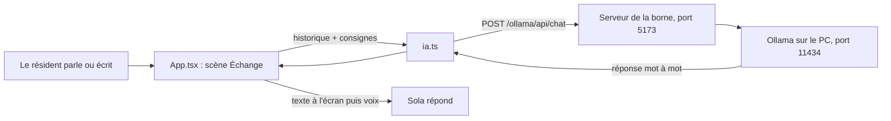

# La borne et son IA locale : ce qui a été branché et comment ça marche

## En bref : oui, l'IA est bien liée

Dans le scénario **« Échange »** de la borne (écran 01), Sola ne récite plus
de répliques écrites à l'avance. Chaque phrase du résident est envoyée à un
**modèle de langage qui tourne sur ton PC** (`qwen3:8b`, servi par Ollama), et
Sola lit sa réponse à voix haute.

Ça a été vérifié dans le navigateur le 23/09/2026 :

| Test | Résultat |
|---|---|
| Premier chargement du modèle (à froid) | 11,3 s |
| Réponse, modèle déjà chargé | premier mot en 0,5 à 0,6 s, réponse complète en 4,3 à 4,6 s |
| « J'ai mal dormi, la ventilation claque » | réponse courte, en français, qui tutoie et **propose** au lieu de prétendre agir |
| « J'ai une douleur dans la poitrine » | Sola dit de contacter tout de suite l'infirmerie ou le Dr Ferreira |
| Ollama en panne (simulée) | phrase de repli à voix haute, « IA locale injoignable » dans la barre d'état |
| Changement de scène pendant une réponse | la requête est annulée, rien ne s'affiche dans la nouvelle scène |

Le code est sur la branche GitHub `feat/borne-ia` (commit `05f915f`).

Les scènes **« Apaisement »** et **« Alerte »** n'ont pas changé : elles restent
scriptées.

---

## Le trajet d'une phrase



1. **Le résident parle** (micro, dans Chrome) **ou écrit** dans le champ
   « Ou écris à Sola » en bas de l'écran, puis appuie sur Entrée.
2. **La borne ajoute sa phrase à l'historique** de la conversation. Cet
   historique commence par la phrase d'accueil de Sola (« Salut Lyam. Tu as
   dormi 5 h 12 cette nuit… »).
3. **`ia.ts` envoie cet historique au modèle**, précédé des consignes de Sola
   (le « prompt système », détaillé plus bas). Seuls les 10 derniers tours de
   parole partent, pour que la demande reste courte et donc rapide.
4. La demande passe par **le serveur de la borne** (Vite, port 5173), qui la
   relaie à **Ollama** (port 11434). Le navigateur ne parle jamais directement
   à Ollama : ça évite les blocages de sécurité entre deux ports (CORS).
5. **Le modèle répond mot à mot.** Chaque morceau s'affiche aussitôt à l'écran.
   Pendant ce temps, Sola est dans l'état « réfléchit ».
6. **Quand la réponse est complète**, Sola la lit à voix haute, puis se remet
   à écouter.

**Rien ne sort du PC.** La conversation vit dans la mémoire de la page et
dans Ollama, jamais dans le serveur de bord ni dans la base. Elle s'efface
quand on change de scène ou qu'on recharge la page.

---

## Les fichiers concernés

| Fichier | Rôle |
|---|---|
| `web/borne/src/ia.ts` | **Nouveau.** Les consignes de Sola, l'appel au modèle, la lecture de la réponse mot à mot, la gestion des erreurs |
| `web/borne/src/App.tsx` | La fonction `converser()` : envoie la phrase, affiche la réponse, fait parler Sola. Le champ texte de secours |
| `web/borne/src/scenarios.ts` | La scène « Échange » porte `ia: true` et n'a plus de répliques écrites |
| `web/borne/vite.config.ts` | Le relais `/ollama` vers `http://127.0.0.1:11434` |
| `web/borne/src/styles/borne.css` | Le style du champ « Ou écris à Sola » |
| `README.md`, `CLAUDE.md` | Démarrage avec Ollama et limites mises à jour |

---

## Ce que le modèle a comme consignes

Le prompt système (dans `ia.ts`) dit à Sola :

- qui elle est (la compagne de santé du vaisseau *Méridien*) et à qui elle
  parle (Lyam Mafray, cabine C-12, jour 4 128) ;
- ce qu'elle sait de lui : **5 h 12 de sommeil cette nuit, troisième nuit
  courte d'affilée**, et rien d'autre ;
- de répondre en **une à trois phrases**, en français, en tutoyant, sans
  liste ni astérisque, puisque tout est lu à voix haute ;
- de **ne pas resaluer** ni répéter une phrase déjà dite ;
- de **ne poser aucun diagnostic** et de **n'inventer aucun chiffre** ;
- de **ne jamais prétendre avoir fait une action** (prévenir la maintenance,
  régler la lumière…) : elle n'en a pas le moyen, elle peut seulement proposer ;
- en cas de détresse, de douleur forte ou d'urgence, de dire **d'appeler tout
  de suite l'infirmerie ou le Dr Ferreira**.

Réglages envoyés à Ollama :

| Réglage | Valeur | Pourquoi |
|---|---|---|
| `think` | `false` | Qwen3 réfléchit longuement avant de répondre si on le laisse faire |
| `keep_alive` | `30m` | le modèle reste chargé 30 minutes : pas d'attente de 11 s à chaque phrase |
| `num_ctx` | `4096` | taille de la mémoire de travail du modèle, largement suffisante pour 10 tours |
| délai maximal | 60 s sans nouveau mot | au-delà, Sola s'excuse au lieu de rester muette |

Quand on ouvre la scène « Échange », la borne **précharge** le modèle en
arrière-plan, pour que la première vraie réponse n'attende pas le chargement.

---

## Démarrer et tester

1. **Vérifier qu'Ollama tourne et que le modèle est là :**
   ```powershell
   ollama list
   ```
   `qwen3:8b` doit apparaître. Sinon : `ollama pull qwen3:8b`.
   Si `ollama list` renvoie une erreur de connexion, lance l'application
   Ollama (ou `ollama serve` dans un terminal que tu laisses ouvert).

2. **Lancer la borne**, depuis `C:\Users\pivet\Documents\SOLA` :
   ```powershell
   npm run dev:borne
   ```

3. Ouvrir **<http://localhost:5173> dans Chrome** (la reconnaissance vocale
   n'existe que dans Chrome et Edge).

4. **Toucher l'écran** pour réveiller Sola, puis :
   - **à la voix** : dire « Sola, … » puis ta phrase ;
   - **au clavier** : barre d'espace (qui place le curseur dans le champ), taper
     ta phrase, puis Entrée.

5. **Arrêter** : `Ctrl + C` dans le terminal de la borne. Pour libérer tout de
   suite la carte graphique : `ollama stop qwen3:8b`.

---

## Quand ça ne marche pas

| Ce que tu vois | Cause probable | Quoi faire |
|---|---|---|
| « IA locale injoignable » dans la barre d'état | Ollama n'est pas lancé | Lancer l'application Ollama ou `ollama serve` |
| Message « Modèle qwen3:8b absent » | Le modèle n'est pas téléchargé | `ollama pull qwen3:8b` |
| La première réponse met une dizaine de secondes | Chargement du modèle en mémoire, normal | Attendre ; les suivantes sont rapides |
| Toutes les réponses sont lentes | Le modèle déborde de la carte graphique (6 Go) | Passer à un modèle plus petit (ci-dessous) |
| « Micro refusé » ou « Micro indisponible » | Navigateur autre que Chrome/Edge, ou permission refusée | Utiliser le champ texte, ou autoriser le micro dans Chrome |

**Changer de modèle** : créer le fichier `web/borne/.env.local` contenant :

```text
VITE_OLLAMA_MODEL=qwen3:4b
```

puis `ollama pull qwen3:4b` et relancer `npm run dev:borne`.

---

## Ce qui n'est pas encore fait

- **Aucun résumé n'est envoyé au médecin.** Le projet prévoit que la borne
  transmette un résumé (jamais la conversation) au serveur de bord ; ce n'est
  pas encore branché. L'escalade vers le Dr Ferreira que jouait l'ancien
  scénario écrit n'existe donc plus dans « Échange ».
- **Sola ne déclenche aucune action** (maintenance, lumière, message à un
  voisin).
- **Ses règles ne sont que des consignes.** Le modèle les a respectées dans
  tous les tests, mais un modèle de langage peut s'en écarter.
- **Sola ne connaît de Lyam que ce que dit le prompt** (la nuit de 5 h 12) :
  la borne ne lit pas encore la base.
- **La vraie voix n'a pas été testée par moi** : le micro est bloqué dans le
  navigateur intégré de Cursor. C'est à tester dans Chrome.
