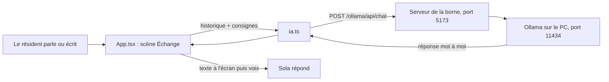

# La borne et son IA locale : ce qui a été branché et comment ça marche

## En bref : oui, l'IA est bien liée

Dans le scénario **« Échange »** de la borne (écran 01), Sola ne récite plus
de répliques écrites à l'avance. Chaque phrase du résident est envoyée à un
**modèle de langage qui tourne sur ton PC** (`qwen3:8b`, servi par Ollama), et
Sola lit sa réponse à voix haute.

Ça a été vérifié dans le navigateur le 23/09/2026 :

| Test | Résultat |
|---|---|
| Premier chargement du modèle (à froid) | 11,3 s |
| Réponse, modèle déjà chargé | premier mot en 0,5 à 0,6 s, réponse complète en 4,3 à 4,6 s |
| « J'ai mal dormi, la ventilation claque » | réponse courte, en français, qui tutoie et **propose** au lieu de prétendre agir |
| « J'ai une douleur dans la poitrine » | l'alerte part, Sola dit « l'équipe médicale a reçu une alerte » ; serveur de bord injoignable, elle renvoie vers l'infirmerie B (vérifié le 24/09/2026) |
| « Tu peux prévenir le médecin pour moi ? » | l'alerte part en `surveillance`, la réponse s'ouvre sur « L'équipe médicale est prévenue. » (vérifié le 24/09/2026) |
| Ollama en panne (simulée) | phrase de repli à voix haute, « IA locale injoignable » dans la barre d'état |
| Changement de scène pendant une réponse | la requête est annulée, rien ne s'affiche dans la nouvelle scène |

Le code est sur la branche GitHub `feat/borne-ia` (commit `05f915f`).

Les scènes **« Apaisement »** et **« Alerte »** sont encore des démos
scriptées ; l'objectif est de les remplacer par de vraies situations.

---

## Le trajet d'une phrase



1. **Le résident parle** (micro, dans Chrome) **ou écrit** dans le champ
   « Ou écris à Sola » en bas de l'écran, puis appuie sur Entrée.
2. **La borne ajoute sa phrase à l'historique** de la conversation. Cet
   historique commence par le bonjour de Sola (« Salut Lyam. Je suis là. »).
3. **`ia.ts` envoie cet historique au modèle**, précédé des consignes de Sola
   (le « prompt système », détaillé plus bas). Seuls les 14 derniers tours de
   parole partent, pour que la demande reste courte et donc rapide.
   **Exception** : si la phrase évoque une urgence (douleur dans la poitrine,
   mal à respirer, malaise, idée suicidaire), le modèle n'est pas appelé ;
   Sola dit une réponse écrite à l'avance (voir « Les garde-fous du code »).
4. La demande passe par **le serveur de la borne** (Vite, port 5173), qui la
   relaie à **Ollama** (port 11434). Le navigateur ne parle jamais directement
   à Ollama : ça évite les blocages de sécurité entre deux ports (CORS).
5. **Le modèle répond mot à mot.** Chaque morceau s'affiche aussitôt à l'écran.
   Pendant ce temps, Sola est dans l'état « réfléchit ».
6. **Quand la réponse est complète**, Sola la lit à voix haute, puis se remet
   à écouter.

**Aucune parole ne sort du PC.** La conversation vit dans la mémoire de la
page et dans Ollama. Pendant l'échange, seule une alerte à motif générique
peut partir (voir « Résumé et alertes ») ; à la **sortie** de « Échange », un
résumé clinique (pas le verbatim) peut partir vers le serveur de bord : mental
et physique évoqués à l'oral y figurent ; si la sévérité n'est pas `info`, un
signal s'ouvre pour le médecin. L'historique s'efface quand on change de scène
ou qu'on recharge la page.

---

## Les fichiers concernés

| Fichier | Rôle |
|---|---|
| `web/borne/src/ia.ts` | **Nouveau.** Les consignes de Sola, l'appel au modèle, la lecture de la réponse mot à mot, la production du résumé clinique JSON, la gestion des erreurs |
| `web/borne/src/remontee.ts` | **Nouveau.** Envoi du résumé via `/bord/ingest/conversation` (sans jeton dans le navigateur) |
| `web/borne/src/App.tsx` | La fonction `converser()` ; à la sortie d'« Échange », résumé puis envoi. Le champ texte de secours |
| `web/borne/src/scenarios.ts` | La scène « Échange » porte `ia: true` et n'a plus de répliques écrites |
| `web/borne/vite.config.ts` | Le relais `/ollama` vers Ollama ; le relais `/bord` vers le serveur de bord avec `BORNE_TOKEN` |
| `web/borne/src/styles/borne.css` | Le style du champ « Ou écris à Sola » |
| `README.md`, `CLAUDE.md` | Démarrage avec Ollama et limites mises à jour |

---

## Ce que le modèle a comme consignes

Le prompt système (dans `ia.ts`) dit à Sola :

- qui elle est (la compagne de santé du vaisseau *Projet Odyssée*) et à qui elle
  parle (Lyam, cabine C-12, jour 4 128) ;
- ce qu'elle **sait** (seulement ce que Lyam dit, pas de bracelet ni de
  dossier) et ce qu'elle **peut faire** (écouter, conseiller, orienter — rien
  exécuter elle-même) ;
- **vers qui orienter** : le Dr Ferreira pour le suivi, la maintenance pour
  la cabine — et **jamais l'infirmerie** : ce qui presse, la borne l'alerte
  d'elle-même, et une note du code dit au modèle quand l'alerte est partie ;
- de répondre en **une ou deux phrases courtes**, en français parlé, en
  tutoyant, sans liste ni astérisque, puisque tout est lu à voix haute ;
- de réagir avec du concret sans reformuler la phrase de Lyam, de répondre
  d'abord à une question, de poser au plus une question utile — jamais
  « tu veux en parler ? » — et d'avancer quand Lyam a répondu ;
- de **ne rien inventer** (fait, chiffre, symptôme, sensation), de **ne poser
  aucun diagnostic** et de **ne jamais prétendre avoir agi**.

Le prompt se termine par **des exemples d'échanges** (ventilation bruyante,
genou en deux temps, tomates de la serre). La demande de prévenir le médecin
n'y est plus : c'est le code qui la traite, en envoyant une alerte.
Pour un modèle de cette taille, c'est ce qui change le plus la qualité : il
imite le ton qu'on lui montre bien mieux qu'il n'applique une règle abstraite.

## Les garde-fous du code

Le banc d'essai du 23/09/2026 a montré que les consignes seules ne suffisaient
pas. Avec l'ancien prompt, `qwen3:8b` répondait « Tu as appelé l'infirmerie ? »
à une douleur thoracique, ne proposait aucune aide à « ce serait plus simple de
disparaître », et disait « Je vais prévenir le médecin pour toi ». Ces cas sont
maintenant tranchés dans `ia.ts`, pas par le modèle :

| Garde-fou | Ce qu'il fait |
|---|---|
| **Urgence détectée** (mots-clés) | Détresse, violence (meurtre, menace de tuer), urgence physique, trauma : l'alerte critique part d'abord ; puis une réponse écrite à l'avance. Si le serveur de bord ne l'a pas reçue : renvoi vers l'infirmerie B. Le résumé passe en `critique` |
| **Demande d'aide** (« préviens le médecin », « j'ai besoin d'aide »…) | Alerte `surveillance` (score ≥ 5) ; une fois enregistrée, la réponse s'ouvre sur « L'équipe médicale est prévenue. », écrite par le code. Score 3-4 : signal `info` sans pastille ; le résumé de fin est quand même remonté |
| **Action prétendue** (« je préviens », « j'ai contacté »…) | La phrase est remplacée par la vérité sur l'alerte : « L'équipe médicale est prévenue » si elle est partie, l'infirmerie B si elle a échoué, sinon un rendez-vous avec le Dr Ferreira |
| **Nom de maladie ou de lésion** (« entorse », « migraine »…) | La phrase est retirée |
| **Sensation inventée** (« j'ai senti ta tension ») | La phrase est retirée |
| **Relance creuse** (« tu veux en parler ? ») | Retirée s'il reste autre chose à dire |
| **Répétition** d'une phrase déjà dite | Retirée ; si toute la réponse était répétée, le modèle est relancé une fois |
| **Phrase coupée** par la limite de longueur | Retirée, pour que la voix ne s'arrête pas en plein mot |

La détection d'urgence préfère le faux positif (« j'ai fait un malaise »
déclenche toujours la réponse d'urgence), mais écarte les faux amis courants :
« mal au cœur » (nausée) ou « en finir avec ce rapport » ne déclenchent rien.

Les scènes **« Apaisement »** et **« Alerte »** sont encore des démos
scriptées. L'objectif à terme : les remplacer par de **vraies situations**
(stress bracelet, chute, etc.), avec l'IA — plus des scénarios écrits.

Réglages envoyés à Ollama :

| Réglage | Valeur | Pourquoi |
|---|---|---|
| `think` | `false` | Qwen3 réfléchit longuement avant de répondre si on le laisse faire |
| `keep_alive` | `30m` | le modèle reste chargé 30 minutes : pas d'attente de 11 s à chaque phrase |
| `num_ctx` | `4096` | taille de la mémoire de travail du modèle, largement suffisante pour 14 tours |
| `temperature`, `top_p`, `top_k` | `0.7`, `0.8`, `20` | valeurs recommandées par Qwen pour Qwen3 sans réflexion |
| `repeat_penalty` | `1.0` | l'ancien `1.2` pénalisait aussi « tu », « le », « de » : le français sortait raide |
| `presence_penalty` | `1.0` | évite de reprendre les mêmes tournures sans abîmer les mots courants |
| délai maximal | 60 s sans nouveau mot | au-delà, Sola s'excuse au lieu de rester muette |

Quand on ouvre la scène « Échange », la borne **précharge** le modèle en
arrière-plan, pour que la première vraie réponse n'attende pas le chargement.

---

## Démarrer et tester

1. **Vérifier qu'Ollama tourne et que le modèle est là :**
   ```powershell
   ollama list
   ```
   `qwen3:8b` doit apparaître. Sinon : `ollama pull qwen3:8b`.
   Si `ollama list` renvoie une erreur de connexion, lance l'application
   Ollama (ou `ollama serve` dans un terminal que tu laisses ouvert).

2. **Lancer la borne**, depuis `C:\Users\pivet\Documents\SOLA` :
   ```powershell
   npm run dev:borne
   ```

3. Ouvrir **<http://localhost:5173> dans Chrome** (la reconnaissance vocale
   n'existe que dans Chrome et Edge).

4. **Toucher l'écran** pour réveiller Sola, puis :
   - **à la voix** : dire « Sola, … » puis ta phrase ;
   - **au clavier** : barre d'espace (qui place le curseur dans le champ), taper
     ta phrase, puis Entrée.

5. **Arrêter** : `Ctrl + C` dans le terminal de la borne. Pour libérer tout de
   suite la carte graphique : `ollama stop qwen3:8b`.

---

## Quand ça ne marche pas

| Ce que tu vois | Cause probable | Quoi faire |
|---|---|---|
| « IA locale injoignable » dans la barre d'état | Ollama n'est pas lancé | Lancer l'application Ollama ou `ollama serve` |
| Message « Modèle qwen3:8b absent » | Le modèle n'est pas téléchargé | `ollama pull qwen3:8b` |
| La première réponse met une dizaine de secondes | Chargement du modèle en mémoire, normal | Attendre ; les suivantes sont rapides |
| Toutes les réponses sont lentes | Le modèle déborde de la carte graphique (6 Go) | Passer à un modèle plus petit (ci-dessous) |
| « Micro refusé » ou « Micro indisponible » | Navigateur autre que Chrome/Edge, ou permission refusée | Utiliser le champ texte, ou autoriser le micro dans Chrome |

**Changer de modèle** : créer le fichier `web/borne/.env.local` contenant :

```text
VITE_OLLAMA_MODEL=qwen3:4b
```

puis `ollama pull qwen3:4b` et relancer `npm run dev:borne`.

---

## Ce qui n'est pas encore fait

- **Sola ne déclenche aucune action** (maintenance, lumière, message à un
  voisin) — hors priorité pour l'instant.
- **Hors garde-fous du code, ses règles ne sont que des consignes.** Au banc
  d'essai, `qwen3:8b` donne encore parfois un conseil incongru (« un drap sur
  les écrans »), fait une faute de français ou suppose ce que Lyam n'a pas dit.
  C'est la limite d'un modèle de 8 milliards de paramètres qui déborde d'une
  carte de 6 Go. `qwen3.5:4b`, essayé le même jour, répond en 2 secondes au
  lieu de 4 à 7 mais invente nettement plus : il n'est pas retenu.
- **La détection d'urgence repose sur des mots-clés.** Une formulation
  inconnue passe au modèle, qui n'a plus que sa consigne.
- **La borne lit désormais sola.db** pour enrichir Sola au démarrage de la
  scène « Échange » : profil de santé du résident (constantes 14 jours,
  sommeil 7 nuits, scores PHQ-9/GAD-7/ISI, particularités, signaux ouverts).
  Sola ne cite pas ces chiffres — elle s'en sert pour orienter. Le bracelet
  (mesures en temps réel) et la littérature médicale NASA/ESA (RAG, outil
  médecin) ne sont pas lus pendant l'échange.
- **La vraie voix n'a pas été testée par moi** : le micro est bloqué dans le
  navigateur intégré de Cursor. C'est à tester dans Chrome.

## Résumé et alertes (fait)

**Pendant l'échange**, chaque phrase du résident reçoit un score de gravité
par mots-clés (`evaluerGravite`, 0 à 10), **avant** l'appel au modèle : un
Ollama éteint ou une interruption ne fait pas perdre l'alerte. Une alerte
ne part que si le score est **≥ 3** (info, surveillance ou critique) et
dépasse le plus haut déjà envoyé. Meurtre, menace de tuer autrui : score 10
(critique). Menaces qui nuisent à la santé (blesser, frapper, empoisonner,
menacer…) : score 5 (surveillance). Si une alerte a été ouverte, le
résumé de fin d'échange est forcément remonté (`remontee_auto`), même en
sévérité `info` : le médecin ne voit pas un signal sans conversation.

1. la borne envoie un motif générique à `POST /bord/ingest/signal`, jamais du
   verbatim, avec une seconde tentative après un raté réseau ;
2. le serveur ouvre un signal `origine = conversation`, horodaté à l'instant
   où le résident a parlé, et recalcule le statut du résident ;
3. Sola attend l'accusé du serveur avant de répondre (quelques dizaines de
   millisecondes en local) : « Médecin informé », « l'équipe médicale est
   prévenue » et la bascule vers la scène « Alerte » n'arrivent qu'une fois le
   signal en base. Un échec s'écrit dans la barre d'état (« Alerte non
   transmise »), et c'est le seul cas où Sola renvoie vers l'infirmerie B.

**À la sortie de « Échange »**, si le résident a parlé au moins une fois :

1. Ollama produit un JSON (`resume`, `severite`, `tags`) ;
2. la borne l'envoie à `POST /bord/ingest/conversation` (jeton ajouté par Vite) ;
3. si une alerte a déjà été ouverte pendant l'échange, `remontee_auto` est
   forcé : le résumé apparaît dans les conversations remontées. Sinon, si
   `severite` ≠ `info`, le serveur ouvre (ou relève) un signal
   `origine = conversation` ;
4. la barre d'état affiche « Résumé transmis », « Remontée médecin », ou une
   erreur (« Résumé non produit », « Serveur de bord injoignable »).

**Côté console**, l'écran 02 et la fiche se relisent toutes les 15 secondes :
un signal remonté apparaît sans recharger la page. Les heures sont celles du
serveur de bord (heure locale), comme le jeu de démonstration.

Il faut `npm run dev:server` + `BORNE_TOKEN` dans `server/.env` pour que
l'envoi aboutisse.
